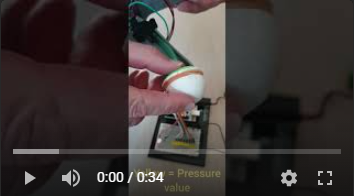
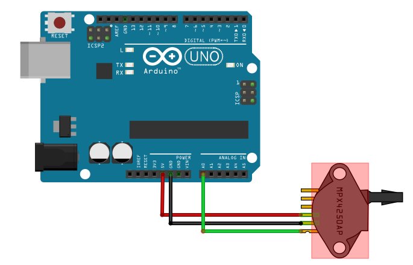
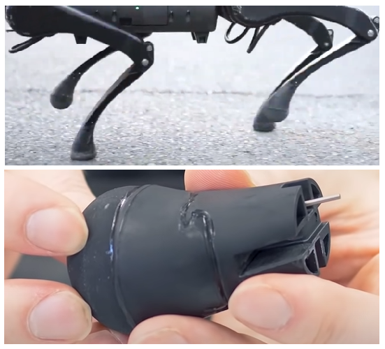
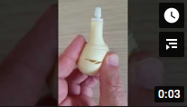
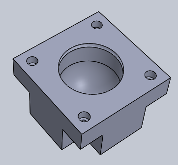
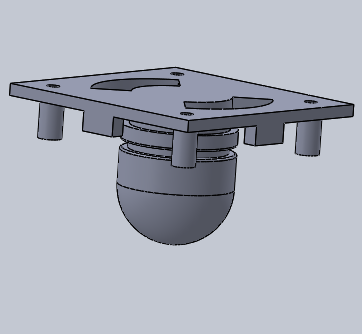
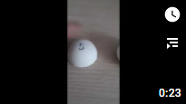
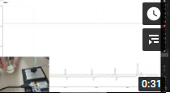

# SpotMicro: New leg with pressure sensor

[Version française](./README_FR.md)

<a id="up"> </a>

The pressure sensor at the end of the leg will allow you to know:
- If it hits the ground (Boolean True / False)
- The force exerted on it
- And at an instant "t" the direction of the force exerted (pressure // release)

[](https://youtu.be/5eInNg3Okts)

---

## Wiring

The wiring is very simple, the pressure is read on an analog port:



---

## LegPressureSensor Library

Written for VSCode, just copy it to the *./Lib* folder of your Plateform-IO project.

### The Constants

```C
const uint16_t CALIBRATE_NB = 500;
const uint8_t TRIGGER_PRESSURE = 10;
const uint8_t TRIGGER_DIRECTION = 5;
```

- CALIBRATE_NB : Number of measurements when calculating the calibration value.
- TRIGGER_PRESSURE : Deviation from the calibration validating a change of state.
- TRIGGER_PRESSURE : Deviation from the calibration validating a change of direction.

### Public Methods (functions)

```C
//Constructor
LegPressureSensor(const uint8_t pin);

// Calculation of the calibration
void calibrate();   

// Pressure reading and state update
void read();

// Return the last measured pressure
uint16_t pressureValue();

// Return the calculated released pressure
uint16_t calibrateValue();

// Return the current max pressure
uint16_t pressureMax();

// Return the direction of movement
int8_t   direction();

// Returns True / False if pressed
bool isPressed();
```

- `LegPressureSensor (const uint8_t pin)`: The Constructor with the analog pin as a parameter, returns an object corresponding to this class.

- `calibrate()` : carry out *CALIBRATE_NB* measurement afterwards then calculate the average. This method must be called with the paw raised thus allowing to have a reference.

- `read()` : reading of the measure, UPDATE of the maximum value and the state of the tab, returns nothing.

- `pressureValue()` : returns the value of the measurement performed by the `read()` method.

- `calibrateValue()` : returns the calibration value calculated by the `calibrate()` method.

- `pressureMax())` : returns the maximum value exerted since the start of the pressure, it is reset to zero when the tab is released.

- `direction()`: allows to know at a moment * 't' * if the movement continues towards a pressure (+1) a release (-1) or is stationary (0).

- `isPressed()` : returns *True* if the pressure exerted is greater than u equal to the calibration + *TRIGGER_PRESSURE*, otherwise returns *false*.

---


## Creation of "pear"

<a id="pear"> </a>

Just like the leg of Unitree's A1 robot, I set out to create a flexible "Pear".



First by 3d printing in filament ** FLEX ** (TPU), but the exercise is not easy because it is flexible and it is difficult to have a constant flow at the output extruder.
After tests of different thicknesses, it remains too rigid and it tears very quickly:

[](https://youtu.be/qxboo4HXB_k)

I have not tested the TPE filament which is even more flexible because the experience with the FLEX was already complicated.

---

## New Option : **Silicone**

<a id="silicone"> </a>

The principle is to 3D print molds in order to "model" Silicone of bathroom joints:

<div align="center">&nbsp;</div>  

The Silicone is first kneaded in water saturated with dishwashing liquid:

[](https://youtu.be/qxboo4HXB_k)

A few hours of drying and our part is ready, several thickness tests have been carried out:

[](https://youtu.be/qxboo4HXB_k)

---

## Pressure sensor

<a id="sensor"> </a>

Having no idea of the pressure differential in the "pear" between a pressed or released state, I tested 2 sensors with different accuracy.

I chose analog sensors because all of the I2Cs found had a fixed address, therefore incompatible with the SportMicro which has 4 legs, therefore 4 pressure sensors.

### **MPX4250AP**
With an accuracy of 20 mV / kPa, this sensor is not sensitive enough, even when I blow into it to the maximum, the value varies only very slightly.

### **MPX5010DP**
With an accuracy of 450mv / kPa, this sensor is great, I capture light pressures as well as large crushes:

[](https://youtu.be/x-UZMXbWamg)

[DataSheet MPX5010DP](./datasheets/mpx5010-2165.pdf)

---

## Modification of the leg

*Work in progress*