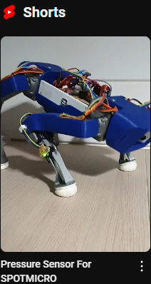

# SpotMicro: Nouvelle patte avec capteur de pression

[English version](./README.md)

Ce projet a pour but de rajouter des capteurs de pression au bout de chaque patte du SpotMicro afin de connaitre :
- Si elle touche le sol (booléen True / False)
- La force exercée sur chacune d'elle
- Et à un instant "t" la direction de la force exercée (pression // relâchement)

## Sommaire

- ### [La genèse du projet et les spécifications fonctionnelles](./docs/GENESIS_FR.md)
- ### [La Fabrication](./docs/MAKING_FR.md)
- ### [La Programmation](./docs/CODING_FR.md)