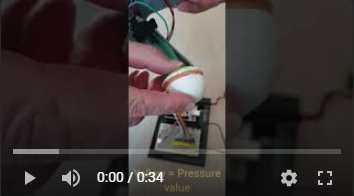
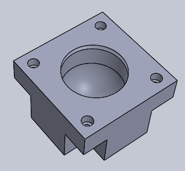

# SpotMicro: Nouvelle patte avec capteur de pression

[Version anglaise](./README.md)

Le capteur de pression au bout de la patte va permettre de savoir :
- Si elle touche le sol (booléen True / False)
- La force exercée sur celle ci
- Et à un instant "t" la direction de la force exercée (pression // relâchement)

---

## Création de la "Poire"

A l'image de la patte du robot A1 d'Unitree, je suis partie sur la création d'une "Poire" flexible.

D'abord par impression 3d en filament **FLEX** (TPU), mais l'exercice n'est pas facile car celui est flexible (ben oui !!!) et il est difficile d'avoir un débit constant à la sortie de l'extrudeur.
Après des tests de différentes épaisseurs, cela reste trop rigide est ce déchire très rapidement:

Je n'ai pas testé le filament TPE qui est encore plus souple car l'expérience avec le FLEX était déjà compliquée.

---

## Nouvelle Option : **le Silicone**

Le principe est d'imprimer des moules en 3D afin de "modeler" du Silicone de joints de salle de bain :

&nbsp;
  

Le Silicone est au préalable malaxé dans de l'eau saturé en liquide vaisselle :

**VIDEOOOOOOOOOOOOO**

Quelques heures de séchage et voilà notre pièce est prête, plusieurs Tests d'épaisseur ont été réalisé:

---

## Le capteur de pression

N'ayant aucune idée du différentiel de pression dans la "poire" entre un état pressé ou relaché, j'ai testé 2 capteurs avec un précision différente.

J'ai choisi des capteurs analogiques car l'ensemble des I2C trouvés avaient une adresse fixe, donc incompatible avec le SportMicro qui a 4 pattes, donc 4 capteurs de pression.

### **MPX4250AP**
Avec une précision de 20 mV/kPa, ce capteur n'est pas assez sensible, même quand je souffle dedans au maximum, la valeur ne varie que très légèrement.

### **MPX5010DP**
Avec une précision de 450mv/kPa, ce capteur est super,je capte les légères pressions ainsi que les gros écrasements:

---

# Modification de la patte

*Travail en cours*

