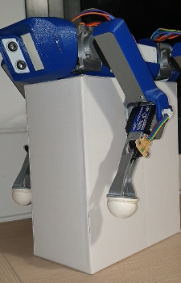

# Programming
The examples given use the libraries of the [Choreograph](https://github.com/Nao974/choreograph-git) project for the management of movements and servomotors. I let you take a look at this related project.

Libraries for the management of servos not documented in this project:
- lib/choreograph
- lib/Oscillator
- lib/Servo

## LegPressureSensor Library

Written for VSCode, just copy it into the *./lib* folder of your Plateform-IO project.

### Constants

```C
const uint16_t CALIBRATE_NB = 100;
const float CALIBRATE_STANDARD_DEVIATION = 350.0;
const uint8_t TRIGGER_PRESSURE = 10;
const uint8_t TRIGGER_DIRECTION = 5;
```

- CALIBRATE_NB: Number of measurements when calculating the calibration value
- CALIBRATE_STANDARD_DEVIATION: Standard deviation used in calculating the normalization coefficient
- TRIGGER_PRESSURE: Deviation from the calibration validating a change of state.
- TRIGGER_PRESSURE: Deviation from the calibration validating a change of direction.

### Public Methods (functions)

```C
void init(const uint8_t pinPC, const uint8_t pinLed);  // Initialization
        
void calibrateLow(); // Calculation of the calibration in the air  
uint16_t calibrateLowValue(); // Return the calculated released pressure     
void calibrateLowWrite(uint16_t value); // Set value released pressure
        
void calibrateHigh(); // Calculation of the calibration press max         
uint16_t calibrateHighValue(); // Return the calculated released pressure      
void calibrateHighWrite(uint16_t value); // Set value max pressure

void calculateNormalizeFactor(); // Calculation of the normalization factor  
float normalizeFactorValue(); // Return the calculated released pressure                
void normalizeFactorWrite(float value); // Set Ratio Calibration

void read(); // Pressure reading and state update
void readNz(); // Pressure reading, NormaliZation and state update

int16_t pressureValue(); // Return the last measured pressure      
int16_t pressureValueNz(); // Return the last measured pressure normalized

int16_t pressureMax(); // Return the current max pressure
int16_t pressureMaxNz(); // Return the current max pressure normalized

int8_t direction(); // Return the direction of movement      
bool isPressed(); // Returns True / False if pressed

void stateReset(); // Reset state at Release
```

### Declaration and Initialization
Following the example of the program *1xleg_FrontLeft.cpp*

- Declaration of an array of type LegPressureSensor for the 4 legs
```C
LegPressureSensor legs[4];
```

- Initialization of the 4 legs with the analog input pin for reading the sensor and the digital output for the LED:
```C
legs[LEG_FL].init(A8, 13);
legs[LEG_BL].init(A9, 12);
legs[LEG_FR].init(A10, 11);
legs[LEG_BR].init(A11, 10);
```

### Calibration
The robot must be placed on a support with the legs not touching the ground:  


**The calibration must be done *empty* then by compressing the pad**

- Calibration *empty* for the 4 legs:  
```C
for ( uint8_t leg = 0; leg < 4; leg++)
    legs[leg].calibrateLow();
```

- Then calibration with max pressure:
```C
for ( uint8_t leg = 0; leg < 4; leg++) {
    legs[leg].calibrateHigh();
    legs[leg].calculateNormalizeFactor();
}
```

For each leg one after the other, the LED will flash to indicate the leg being calibrated, it is advisable at this time to press the pad several times in order to have the maximum pressure value. Once the measurement is done, the program moves on to the next leg by flashing its LED.

The calibration does not have to be done at each start, you can save the result in non-volatile memory with the function:
```C
epromSave(legs);
```

Then during the following starts, reload the previous calibration:
```C
epromLoad(legs);
```C

The constant allows you to launch or not the calibration:
```C
#define CALIBRATE false
```

## Example Source Code

- **pressureSensorVumetreUno.cpp**: Allows you to test the tab made with visual feedback on an 8 LED vumeter. Assembly made on an Arduino Uno board, it is necessary to modify the environment in *platformio.ini*  
[Youtube video](https://youtu.be/5eInNg3Okts)

- **1xLeg_FrontLeft.cpp**: When pressing on the pad, the leg retracts, it returns to its initial position once the pad is released  
[Youtube video](https://youtube.com/shorts/aT10lHqLCCs)

- **cushion.cpp**: Cushioning of the front legs when it falls or when a blow to the head causes pressure on the front sensors:  
[Youtube video t=9s](https://www.youtube.com/shorts/aT10lHqLCCs?t=9)

---

[back to menu](../README.md)