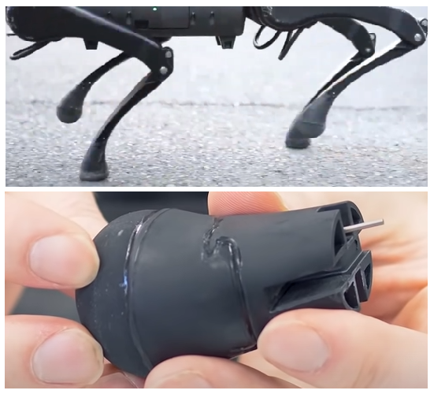
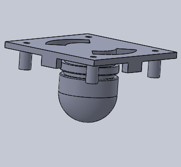
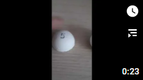

# Project genesis

The realization of a proof of concept (POC) around the MPU6050 gyroscope-accelerometer, highlights a problem of application of the attitude compensation coefficient which can cause the leg to lose contact with the ground and lead to a loss of stability:

Beyond knowing if a leg touches the ground, it would also be interesting to know the pressure exerted on each of them in order to adapt the robot's movements, for example to cushion a fall.

## Functional specifications

- **SF01- For each leg, is it resting on the ground?**

Whatever the pressure exerted on the leg, a variable will indicate by Yes / No if pressure is exerted on it.

- **SF02- For each leg, what is the pressure exerted on it?**

The value of the measured pressure will be a real number, standardized so that the measurements on the 4 legs are comparable on a common scale.

- **SF03- For each leg, what is the direction of the force exerted?**

Depending on the pressure exerted at time T compared to the pressure at T-1, a variable will indicate by Pressed // Released the direction of the force exerted.

## Research and study of existing sensors
The measuring system must be robust and precise, hermetic to dust and gravel.

- Bending sensors
    - These sensors are fragile and deform over time
    - A mechanism to apply force to the sensor will not be hermetic and will not cover the entire point of contact between the leg and the ground

- By Hall effect
    - The idea is to place iron dust in a flexible part at the end of the leg and measure the deformation by a Hall effect sensor
    - The manufacturing of this part will not be standard for each leg
    - The signal will be too complex to analyze for a µController

- By air pressure
    - Like Unitree, create a flexible "pear" and measure the air flow generated by its deformation
    - Totally hermetic
    - Effective regardless of the point and pressure angle
    - Simple signal to process

### Creation of the "Pear"

Like the leg of the Unitree A1 robot, I started to create a flexible "Pear".

First by 3D printing in **FLEX** filament (TPU), but the exercise is not easy because it is flexible (yes indeed!!!) and it is difficult to have a constant flow at the extruder outlet.
After testing different thicknesses, it remains too rigid and tears very quickly:

I have not tested the TPE filament which is even more flexible because the experience with FLEX was already complicated.

---

### New Option: **Silicone**

The principle is to print 3D molds in order to "model" Silicone bathroom joints:

&nbsp;

The Silicone is first kneaded in water saturated with dishwashing liquid:

A few hours of drying and here is our part ready, several Tests thickness have been made:

---

### The air pressure sensor

Having no idea of ​​the pressure differential in the "pear" between a pressed or released state, I tested 2 sensors with different precision.

I chose analog sensors because all the I2C found had a fixed address, therefore incompatible with the SportMicro which has 4 legs, therefore 4 pressure sensors.

#### **MPX4250AP**
With a precision of 20 mV/kPa, this sensor is not sensitive enough, even when I blow into it at maximum, the value varies only very slightly.

#### **MPX5010DP**
With an accuracy of 450mv/kPa, this sensor is great, I capture light pressures as well as heavy crushing:

[DataSheet MPX5010DP](../assets/datasheets/mpx5010-2165.pdf)

## Concept validation

The creation of a silicone pad coupled to the MPX5010DP pressure sensor is validated by the creation of the following prototype:

---

[back to menu](../README.md)