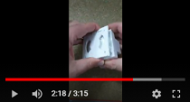

# Genèse du projet

La réalisation d'une preuve de concept (POC) autour du gyroscope-accéléromètre MPU6050, met en évidence un problème d'application de coefficient de compensation de l'assiette qui peut faire perdre le contact de la patte avec le sol et entrainer une perte de stabilité :

Au-delà de connaitre si une patte touche le sol, il serait également intéressant de connaitre la pression exercée sur chacune d'elle afin d'adapter les mouvements du robot, par exemple amortir une chute.

## Spécifications fonctionnelles

- **SF01- Pour chaque patte, est-elle en appui sur le sol ?**

Quelle que soit la pression exercée sur la patte, une variable indiquera par Oui / Non si une pression est exercée sur celle-ci.

- **SF02- Pour chaque patte, quelle est la pression exercée sur celle-ci ?**

La valeur de la pression mesurée sera un nombre réel, standardisé afin que les mesures sur les 4 pattes soient comparables sur une échelle commune.

- **SF03- Pour chaque patte, quelle est la direction de la force exercée ?**

Suivant la pression exercée au moment T en comparaison de la pression à T-1, une variable indiquera par Pressée // Relâchée la direction de la force exercée.

## Recherche et étude des capteurs existants
Le système de mesure doit être robuste et précis, hermétique à la poussière et aux gravillons.

-	Les capteurs de flexion
    - Ces capteurs sont fragiles et se déforment à la longue
    - Un mécanisme afin d'appliquer la force sur le capteur ne sera pas hermétique et ne permettra pas de couvrir la totalité du point de contact entre la patte et le sol

-	Par effet hall
    - L'idée est de placer de la poussière de fer dans une pièce flexible au bout de la patte et de mesurer la déformer par un capteur à effet hall
    - La fabrication de cette pièce ne sera pas standard pour chaque patte
    - Le signal sera trop complexe à analyser pour un µControleur

-	Par pression d’air
    - A l'image d'Unitree, créer une "poire" flexible et mesurer le flux d'air généré par sa déformation
    - Totalement hermétique
    - Efficace quel que soit le point et l'angle de pression
    - Signal simple à traiter

### Création de la "Poire"

A l'image de la patte du robot A1 d'Unitree, je suis partie sur la création d'une "Poire" flexible.

D'abord par impression 3d en filament **FLEX** (TPU), mais l'exercice n'est pas facile car celui est flexible (ben oui !!!) et il est difficile d'avoir un débit constant à la sortie de l'extrudeur.
Après des tests de différentes épaisseurs, cela reste trop rigide est ce déchire très rapidement :

Je n'ai pas testé le filament TPE qui est encore plus souple car l'expérience avec le FLEX était déjà compliquée.

---

### Nouvelle Option : **le Silicone**

Le principe est d'imprimer des moules en 3D afin de "modeler" du Silicone de joints de salle de bain :

&nbsp;
  

Le Silicone est au préalable malaxé dans de l'eau saturé en liquide vaisselle :

Quelques heures de séchage et voilà notre pièce est prête, plusieurs Tests d'épaisseur ont été réalisé :

---

### Le capteur de pression d'air

N'ayant aucune idée du différentiel de pression dans la "poire" entre un état pressé ou relâché, j'ai testé 2 capteurs avec un précision différente.

J'ai choisi des capteurs analogiques car l'ensemble des I2C trouvés avaient une adresse fixe, donc incompatible avec le SportMicro qui a 4 pattes, donc 4 capteurs de pression.

#### **MPX4250AP**
Avec une précision de 20 mV/kPa, ce capteur n'est pas assez sensible, même quand je souffle dedans au maximum, la valeur ne varie que très légèrement.

#### **MPX5010DP**
Avec une précision de 450mv/kPa, ce capteur est super, je capte les légères pressions ainsi que les gros écrasements :

[DataSheet MPX5010DP](../assets/datasheets/mpx5010-2165.pdf)

## Validation du concept

La création de coussinet en silicone couplet au capteur de pression MPX5010DP est validé par la création du prototype suivant :

---

[retour au menu](../README_FR.md)