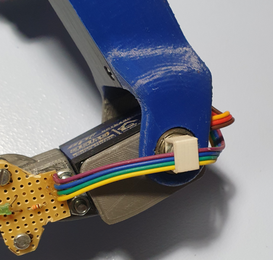

# Manufacturing

There are 3 steps to make a leg with a pressure sensor:

- Printing the modified leg
- Manufacturing the "pads"
- Mini electronic card & wiring

## Modified leg
You will find in the *MCAD* folder the file *L_wrist_mg_pressure.STL* corresponding to the modified leg on the left side. A symmetry from your Slicer will allow you to have the leg on the right side.

- The end has been modified to accommodate the pad.
A "nipple" has been added for the connection to the pressure sensor by a flexible tube of XXX mm diameter.  
  

- A support by the sensor PCB has been added:  

- Finally, it is necessary to add a flexible tube with an internal diameter of 4mm and a length of 55 mm. I found some in a pet store for aquarium air pumps.  

## Making the "cushion"

The principle is to print 3D molds in order to "model" Silicone bathroom joints:

&nbsp;

- The Silicone is first kneaded in water saturated with dishwashing liquid:  

- A few hours drying and here is our part ready, several thickness tests have been carried out, for this it is enough to modify the diameter of the ball of the mold B:  

- RAS on the assembly side, it is enough to add a tight elastic:  

### Mini electronic card & wiring
#### Sensor side card
A 1st card is installed on each leg in order to connect the pressure sensor to the µController:

List of components:
- 1x Sensor mpx5010-2165
- 1x Led
- 1x 220 ohm resistor

Wiring:
- The 1 V OUT pin of the sensor will be connected to an analog input Ax of the µController
- The resistor will be connected to a digital output of the µController Dx allowing the LED to be lit.

#### µController side card
Shield type card to add to the Arduino Mega allowing to transmit the 5V power supply, the ground, the signal to light the LED, and to retrieve the value of the sensor:

#### Grommet
I modeled a grommet to add on the "elbow" of the leg that you will find in the *MCAD* folder:

&nbsp;

---

[back to menu](../README.md)