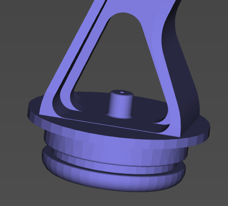
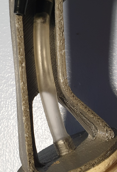

# La Fabrication

Il y 3 étapes afin de réaliser une patte avec capteur de pression :

- Impression de la patte modifiée
- Fabrication des "coussinet"
- Mini carte électronique & câblage

## Patte modifiée
Vous trouverez dans le dossier *MCAD* le fichier *L_wrist_mg_pressure.STL* correspondant à la patte modifiée côté gauche. Une symétrie depuis votre Slicer vous permettra d'avoir la patte coté droit.

- Le bout a été modifié afin d'accueillir le coussinet.
Une "tétine" a été ajouté pour la liaison au capteur de pression par un tube flexible de XXX mm de diamètre.  

- Un support par le PCB du capteur a été ajouté :  

- Pour finir, il convient de rajouter un tube flexible d'un diamètre interne de 4mm et d'une longueur de 55 mm. J'en ai trouvé dans une animalerie pour les pompes à air d'aquarium.  

## Fabrication des "coussinet"

Le principe est d'imprimer des moules en 3D afin de "modeler" du Silicone de joints de salle de bain :

&nbsp;
  

- Le Silicone est au préalable malaxé dans de l'eau saturé en liquide vaisselle :  

- Quelques heures de séchage et voilà notre pièce est prête, plusieurs Tests d'épaisseur ont été réalisé, pour cela il suffit de modifier le diamètre de la boule du moule B :  

- RAS coté montage, il suffit de rajouter un élastique bien serré :  

### Mini carte électronique & câblage
#### Carte coté capteur
Une 1ere carte est installée sur chaque patte afin de relier le capteur de pression au µControleur :  

Liste des composants :  
- 1x Capteur mpx5010-2165
- 1x Led
- 1x résistance 220 ohms

Câblage :  
- La patte 1 V OUT du capteur sera reliée à une entrée analogique Ax du µControleur
- La résistance sera reliée à une sortie digitale du µControleur Dx permettant d'allumer la LED.

#### Carte coté µControleur
Carte de type Shield à rajouter sur l'Arduino Mega permettant de transmettre l'alimentation 5V, la masse, le signal pour allumer la LED, et récupérer la valeur du capteur:  

 

#### Passe-fil
J'ai modélisé un passe-fil à rajouter sur le "coude" de la patte que vous retrouverez dans le dossier *MCAD* : 

&nbsp;
  

---

[retour au menu](../README_FR.md)